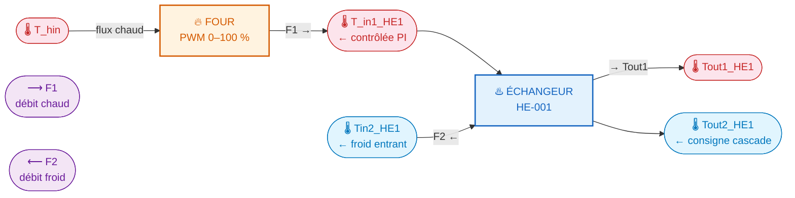
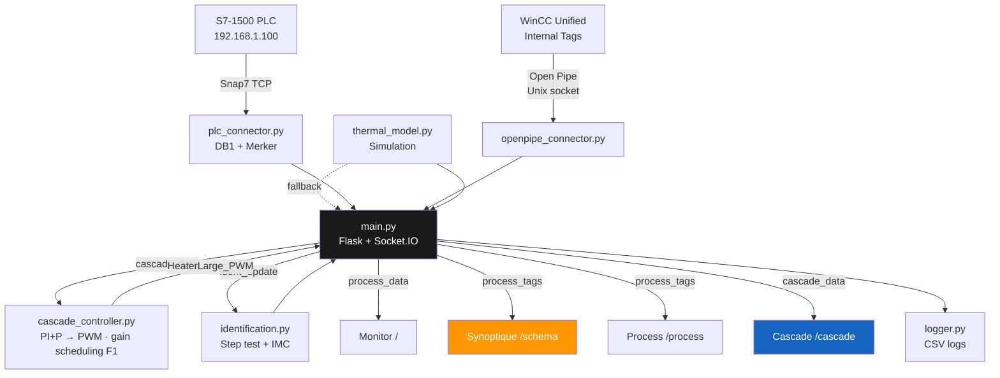

# S7 Thermal Process Monitor

<div align="center">


**Supervision web temps réel d'un procédé thermique Siemens S7-1500**  
Projet de thèse — déployé sur SIMATIC HMI Unified Comfort Panel 7" via Industrial Edge

</div>

---

## Procédé



Le four chauffe le flux F1 → le flux chaud cède sa chaleur au flux froid dans l'échangeur (contre-courant).  
**Régulation :** PI+P sur Tin1\_HE1 (variable manipulée : **PWM heater**) · Cascade Tout2\_HE1 (boucle externe) · **Gain scheduling sur F1**

---

## Démarrage rapide

```bash
git clone https://github.com/eloipicard-sys/project-s7.git
cd project-s7

# Configurer l'IP du PLC
cp .env.example .env   # éditer PLC_IP

# Lancer
docker compose up -d --build

# Accéder
open http://localhost:5000/schema
```

> Sans PLC connecté, l'app démarre automatiquement en **mode simulation**.

---

## Pages

| Route | Description |
|-------|-------------|
| [`/schema`](http://localhost:5000/schema) | **Synoptique** — schéma P&ID plein écran, valeurs live, consignes tactiles |
| [`/cascade`](http://localhost:5000/cascade) | **Cascade** — identification FOPTD, tuning IMC, contrôle cascade (outil ingénieur) |
| [`/`](http://localhost:5000) | **Monitor** — graphiques temps réel, alarmes multi-niveaux, export CSV |
| [`/process`](http://localhost:5000/process) | **Process** — tags WinCC Unified (Four · Éch.1 · Éch.2) |
| [`/test`](http://localhost:5000/test) | **Test DB** — lecture/écriture variables PLC brutes |

---

## Architecture



<details>
<summary>📁 Structure des fichiers</summary>

```
project-s7/
├── app/
│   ├── main.py                   # Flask + Socket.IO + threads background
│   ├── plc_connector.py          # Interface Snap7 → S7-1500 (DB1 + Merker)
│   ├── openpipe_connector.py     # Interface Open Pipe → WinCC Unified
│   ├── cascade_controller.py     # Contrôleur PI+P → PWM, gain scheduling, bumpless
│   ├── identification.py         # Step test automatisé + identification FOPTD
│   ├── thermal_model.py          # Simulation fallback (1er ordre, bruit gaussien)
│   ├── logger.py                 # CSV append-only logger
│   └── templates/
│       ├── schema.html           # Synoptique P&ID (page principale panel)
│       ├── cascade.html          # Identification + contrôle cascade (ingénieur)
│       ├── index.html            # Monitor (charts, alarmes)
│       ├── process.html          # Tags WinCC
│       └── test.html             # Test DB PLC
├── docs/                         # Documentation
├── scripts/                      # Scripts déploiement Pi / Edge
├── docker-compose.yml            # Dev / Raspberry Pi
├── docker-compose.edge.yml       # Production → Simatic Edge Panel
├── Dockerfile
└── .env
```

</details>

<details>
<summary>🔌 API endpoints</summary>

| Endpoint | Méthode | Description |
|----------|---------|-------------|
| `/api/data` | GET | Snapshot procédé (Snap7 / simulation) |
| `/api/process/data` | GET | Tags WinCC Unified |
| `/api/process/write` | POST | Écrire `F1_SP`, `F2_SP` ou `HeaterLarge_PWM` via Open Pipe |
| `/api/setpoint` | POST | Modifier consignes température / débit |
| `/api/cascade/status` | GET | État contrôleur cascade (mode, PWM, gains, F1) |
| `/api/cascade/mode` | POST | Basculer MANUAL / AUTO-INNER / AUTO-FULL |
| `/api/cascade/setpoint` | POST | Modifier Tout2\_SP ou Tin1\_SP |
| `/api/cascade/params` | POST | Mettre à jour gains PI+P (désactive le gain scheduling) |
| `/api/identification/start` | POST | Lancer step test automatique |
| `/api/identification/cancel` | POST | Annuler step test en cours |
| `/api/identification/status` | GET | État et résultats du step test |
| `/api/export/csv` | GET | Télécharger l'historique CSV |
| `/health` | GET | Healthcheck Docker |

</details>

<details>
<summary>🏷️ Tags WinCC Unified</summary>

| Tag | Type | Rôle |
|-----|------|------|
| `T_hin` / `T_hout` | Real | Températures entrée/sortie four |
| `Tin1_HE1` | Real | **Entrée flux chaud HE** — var. contrôlée boucle interne PI |
| `Tout1_HE1` | Real | Sortie flux chaud HE |
| `Tin2_HE1` | Real | Entrée flux froid HE |
| `Tout2_HE1` | Real | **Sortie flux froid HE** — consigne boucle externe cascade |
| `F1` / `F1_SP` | Real | Débit chaud mesuré (L/min) / consigne |
| `F2` / `F2_SP` | Real | Débit froid / consigne |
| `HeaterLarge_PWM` | Real | **Commande PWM heater (0–100 %)** — sortie du contrôleur |
| `Valve_F1` / `Valve_F2` | Int | État vannes (0=CLOSED, 1=OPEN, 2=PARTIAL) |
| `power` | Bool | Alimentation four |
| `*_skal` | Int | Valeurs brutes analogiques (lecture seule) |

</details>

---

## Contrôleur cascade

Le contrôleur implémente un schéma PI+P en forme véloce (incrémentale) :

```
Boucle interne  :  Tin1_HE1  →  PI  →  PWM heater (0–100 %)
Boucle externe  :  Tout2_HE1 →  P   →  Tin1_SP
```

**Gain scheduling** : les gains PI sont recalculés à chaque cycle selon le débit F1 mesuré, via un ajustement en loi puissance identifié expérimentalement (essais du 23/06/2026) :

| F1 (L/min) | K (°C/%) | τ (s) | θ (s) | K\_PI (Normal) |
|:---:|:---:|:---:|:---:|:---:|
| 1 | 1.622 | 116.3 | 25.7 | 0.505 |
| 2 | 0.756 |  56.0 | 18.1 | 1.000 |
| 3 | 0.515 |  44.3 | 15.0 | 1.451 |
| 4 | 0.368 |  37.9 |  4.4 | 2.438 |

Réglage IMC Normal (λ = τ). Trois niveaux disponibles : Aggressive (λ = 0.5τ) · Normal · Conservative (λ = 2τ).

---

## Déploiement

<details>
<summary>🍓 Raspberry Pi (développement standalone)</summary>

```bash
# Premier déploiement
ssh pi@192.168.1.38
git clone https://github.com/eloipicard-sys/project-s7.git
cd project-s7
nano .env          # PLC_IP=192.168.1.100
docker compose up -d --build

# Mise à jour
git pull && docker compose down && docker compose up -d --build
```

App disponible sur `http://192.168.1.38:5000`

> **Limite :** le socket Open Pipe (`/tmp/siemens/automation`) n'est pas accessible depuis un Pi externe — les écritures tombent en fallback simulation.

</details>

<details>
<summary>🖥️ SIMATIC HMI Unified Comfort Panel 7" (production)</summary>

1. Ouvrir **Industrial Edge Publisher** → connecter Docker Engine (`tcp://localhost:2375`)
2. Charger `docker-compose.edge.yml`
3. Publier l'app (port `30500`, `mem_limit: 256m`)
4. Déployer via **Edge Management** → `http://192.168.1.200`
5. Accéder depuis le navigateur du panel : `http://localhost:30500/schema`

**Open Pipe** — volume monté automatiquement :
```
/tmp/siemens/automation → /tempcontainer/
```

> **Statut :** déploiement en attente d'acquisition de licence Industrial Edge pour le panel `192.168.1.200`.

</details>

---

## Configuration `.env`

```env
PLC_IP=192.168.1.100
PLC_RACK=0
PLC_SLOT=1
PLC_DB=1
PORT=5000
FLASK_DEBUG=1
```

---

## Stack technique

| Couche | Technologie |
|--------|------------|
| Backend | Python 3.11 · Flask · Flask-SocketIO |
| PLC | python-snap7 (Snap7 TCP · DB1 + Merker) |
| Panel | Siemens Open Pipe (Unix socket) |
| Contrôle | Cascade PI+P · PWM · Gain scheduling · Identification FOPTD · Tuning IMC |
| Frontend | Vanilla JS · Chart.js · Socket.IO client · Bootstrap 5 |
| Infra | Docker · Docker Compose |
| Cible prod | SIMATIC HMI Unified 7" · Industrial Edge |

---

## Développement local (sans Docker)

```bash
cd app
pip install -r requirements.txt
PLC_IP=192.168.1.100 FLASK_DEBUG=1 python main.py
```

Vérifier que l'app tourne :
```bash
curl http://localhost:5000/health
curl http://localhost:5000/api/cascade/status
```

---

## TIA Portal — prérequis PLC

- Activer **PUT/GET access** : CPU Properties → Protection & Security → Permit access with PUT/GET
- DB1 avec **Optimized block access désactivé**
- Tag `HeaterLarge_PWM` accessible via Open Pipe (nom à confirmer dans WinCC Unified)

---

<div align="center">
<sub>Projet de thèse — Icam site de Bretagne · Politechnika Śląska · Procédé thermique S7-1500</sub>
</div>
