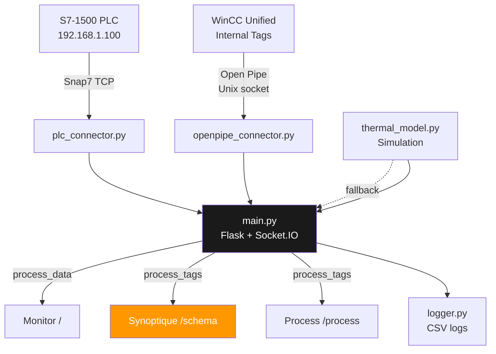

# S7 Thermal Process Monitor

<div align="center">


**Supervision web temps réel d'un procédé thermique Siemens S7-1500**  
Projet de thèse — déployé sur SIMATIC HMI Unified Comfort Panel 7" via Industrial Edge

</div>

---

## Procédé


Le four chauffe le flux F1 → le flux chaud cède sa chaleur au flux froid dans l'échangeur (contre-courant).  
**Régulation :** PI+P sur Tin1 (variable manipulée : F1) · Cascade Tout2 (en développement)

---

## Démarrage rapide

```bash
git clone https://github.com/eloipicard-sys/project-s7.git
cd project-s7

# Configurer l'IP du PLC
cp .env.example .env   # éditer PLC_IP

# Lancer
docker compose up -d --build

# Accéder
open http://localhost:5000/schema
```

> Sans PLC connecté, l'app démarre automatiquement en **mode simulation**.

---

## Pages

| Route | Description |
|-------|-------------|
| [`/schema`](http://localhost:5000/schema) | **Synoptique** — schéma P&ID plein écran, valeurs live, consignes tactiles |
| [`/`](http://localhost:5000) | **Monitor** — graphiques temps réel, alarmes multi-niveaux, export CSV |
| [`/process`](http://localhost:5000/process) | **Process** — 21 tags WinCC Unified (Four · Éch.1 · Éch.2) |
| [`/test`](http://localhost:5000/test) | **Test DB** — lecture/écriture variables PLC brutes |

---

## Architecture



<details>
<summary>📁 Structure des fichiers</summary>

```
project-s7/
├── app/
│   ├── main.py                  # Flask + Socket.IO + threads background
│   ├── plc_connector.py         # Interface Snap7 → S7-1500 (TCP)
│   ├── openpipe_connector.py    # Interface Open Pipe → WinCC Unified (21 tags)
│   ├── thermal_model.py         # Simulation fallback (1er ordre, bruit gaussien)
│   ├── logger.py                # CSV append-only logger
│   └── templates/
│       ├── schema.html          # Synoptique P&ID (page principale panel)
│       ├── index.html           # Monitor (charts, PID, alarmes)
│       ├── process.html         # 21 tags WinCC
│       └── test.html            # Test DB PLC
├── docker-compose.yml           # Dev / Raspberry Pi
├── docker-compose.edge.yml      # Production → Simatic Edge Panel
├── Dockerfile
└── .env
```

</details>

<details>
<summary>🔌 API endpoints</summary>

| Endpoint | Méthode | Description |
|----------|---------|-------------|
| `/api/data` | GET | Snapshot procédé (Snap7 / simulation) |
| `/api/process/data` | GET | 21 tags WinCC Unified |
| `/api/process/write` | POST | Écrire F1_SP ou F2_SP via Open Pipe |
| `/api/setpoint` | POST | Modifier consignes température / débit |
| `/api/export/csv` | GET | Télécharger l'historique CSV |
| `/api/status` | GET | État connexion PLC + statistiques log |
| `/health` | GET | Healthcheck Docker |

</details>

<details>
<summary>🏷️ Tags WinCC Unified (21 variables)</summary>

| Tag | Type | Rôle |
|-----|------|------|
| `T_hin` / `T_hout` | Real | Températures entrée/sortie four |
| `Tin1_wymiennik1` | Real | **Entrée flux chaud HE** — var. contrôlée PI+P |
| `Tout1_wymiennik1` | Real | Sortie flux chaud HE |
| `Tin2_wymiennik1` | Real | Entrée flux froid HE |
| `Tout2_wymiennik1` | Real | **Sortie flux froid HE** — boucle cascade (TBD) |
| `F1` / `F1_SP` | Real | Débit chaud / consigne — **var. manipulée** |
| `F2` / `F2_SP` | Real | Débit froid / consigne |
| `Zawor_F1` / `Zawor_F2` | Word/Int | État vannes |
| `power` | Bool | Alimentation four |
| `*_skal` | Int | Valeurs brutes analogiques (lecture seule) |

</details>

---

## Déploiement

<details>
<summary>🍓 Raspberry Pi (développement)</summary>

```bash
# Premier déploiement
ssh pi@raspberry.local
git clone https://github.com/eloipicard-sys/project-s7.git
cd project-s7
nano .env          # PLC_IP=192.168.1.100
docker compose up -d --build

# Mise à jour
git pull && docker compose down && docker compose up -d --build

# Arrêt propre
docker compose down && sudo shutdown -h now
```

App disponible sur `http://192.168.1.38:5000`

</details>

<details>
<summary>🖥️ SIMATIC HMI Unified Comfort Panel 7" (production)</summary>

1. Ouvrir **Industrial Edge Publisher** → connecter Docker Engine (`tcp://localhost:2375`)
2. Charger `docker-compose.edge.yml`
3. Publier l'app (port `30500`, `mem_limit: 256m`)
4. Déployer via **Edge Management** → `http://192.168.1.200`
5. Accéder : `http://192.168.1.200:30500/schema`

**Open Pipe** — volume monté automatiquement :
```
/tmp/siemens/automation → /tempcontainer/
```

</details>

---

## Configuration `.env`

```env
PLC_IP=192.168.1.100
PLC_RACK=0
PLC_SLOT=1
PLC_DB=1
PORT=5000
FLASK_DEBUG=1
```

---

## Stack technique

| Couche | Technologie |
|--------|------------|
| Backend | Python 3.11 · Flask · Flask-SocketIO |
| PLC | python-snap7 (Snap7 TCP) |
| Panel | Siemens Open Pipe (Unix socket) |
| Frontend | Vanilla JS · Chart.js · Socket.IO client |
| Infra | Docker · Docker Compose · Raspberry Pi |
| Cible prod | SIMATIC HMI Unified 7" · Industrial Edge |

---

<div align="center">
<sub>Projet de thèse — Automatisation industrielle · Procédé thermique S7-1500</sub>
</div>
